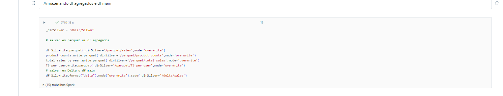
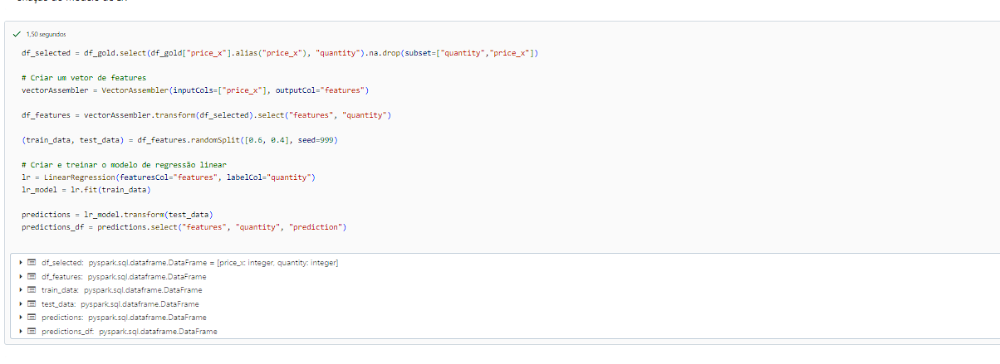
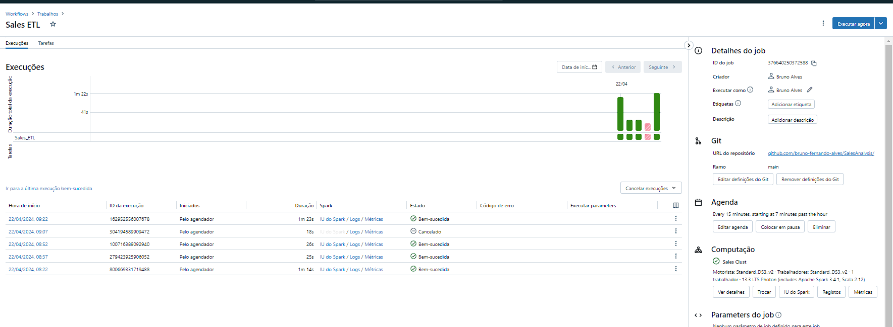

# SalesAnalysis
repositório de analise de vendas
Estrutura de Pastas Após o tratamento
 

# Start Session

Leitura dos dados csv de vendas, essa etapa os dados sem tratamentos
 

Persistencia dos dados em parquet para melhorar a performace de leitura e próximas etapas
 

Separação de dados Ano e Mês, acrescentamos também User
Sempre colocando cada comentário das etapas 

 

Analise exploratora de dados do df, analisando vendas por produtos e top users que mais venderam

 

Salvar os Df agregados em parquet e o df main em Delta para analises posteriores

 

Depois dessas etapas, realizei alguns plots para analisar vendas por anos e tratamento de algumas colunas, posso dizer que eu tentei fazer um modelo de regressão conforme a imagem a seguir:
 

Porém após analise vi que precisaria de mais alguns tratamentos, além disso o ideial seria vários teste para chegar no melhor modelo.

Após tratamentos agendei os jobs

 
O erro que aparece foi eu intencionalmente cancelando o job
